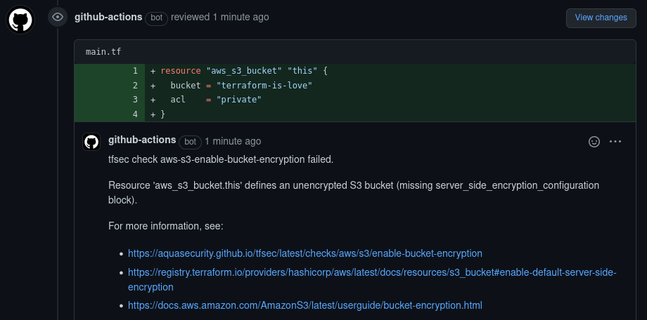
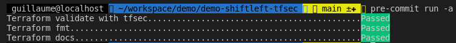
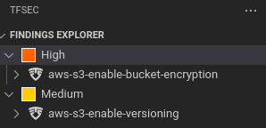

# Demonstration Shiftleft TFSec

Bienvenue sur le répertoire de démonstration du **ShiftLeft** avec **TFSec** !

**[TFSec](https://github.com/aquasecurity/tfsec)** est un outil d'**analyse statique** du code **Terraform**.

Le **ShiftLeft** est le principe d'apporter **la sécurité au plus tôt** dans le cycle de développement applicatif (SDLC).

Je présente ici des solutions pour **exploiter TFSec en respectant le principe de ShiftLeft**.  


## TFSec lors de la Pull Request | Pipeline GitHub CI

On peut exploiter **TFSec** lors d'une **PR** avec une **CI**.

1. Créez une arborescence de dossiers : `mkdir -p .github/workflows`
2. Ajoutez-y le fichier de pipeline : 
```
cat << 'EOF' >.github/workflows/tfsec_pr_commenter.yml
name: tfsec-pr-commenter
on:
  pull_request:
jobs:
  tfsec:
    name: tfsec PR commenter
    runs-on: ubuntu-latest

    steps:
      - name: Clone repo
        uses: actions/checkout@main
      - name: tfsec
        uses: aquasecurity/tfsec-pr-commenter-action@main
        with:
          github_token: ${{ github.token }}
EOF
```

Poussez votre code et faites une MR vers votre branche principale. Une pipeline devrait se déclencher :



Documentation officielle : https://aquasecurity.github.io/tfsec/v0.63.1/getting-started/configuration/github-actions/pr-commenter/

## TFSec lors du commit | Pre-commit

Encore plus tôt dans le cycle de développement applicatif, lors du commit, on peut déclencher automatiquement TFSec avec pre-commit.

1. Ajoutez le fichier de configuration de pre-commit à la racine de votre projet git :

```
cat << 'EOF' >.pre-commit-config.yaml
default_stages: [commit]
repos:
  - repo: https://github.com/antonbabenko/pre-commit-terraform
    rev: v1.62.3
    hooks:
      - id: terraform_tfsec
      - id: terraform_fmt
      - id: terraform_docs
        args:
          - --hook-config=--path-to-file=README.md        # Valid UNIX path. I.e. ../TFDOC.md or docs/README.md etc.
          - --hook-config=--add-to-existing-file=true     # Boolean. true or false
          - --hook-config=--create-file-if-not-exist=true # Boolean. true or false
EOF
```

2. Hookez pre-commit avec votre shell :
```
pre-commit install
```

3. Stagez et commitez vos modifications de code Terraform

4. Vous devriez voir pre-commit effectuer les différents tests configurés (ici en réussite) :




Site officiel : https://pre-commit.com/  
Répertoire du hook pre-commit exploité : https://github.com/antonbabenko/pre-commit-terraform  

## Manuellement | TFSec manuel ou Plugin Visual Studio Code ou pre-commit trigger

On peut déclencher tfsec avant même le commit.

### TFSec

Vous pouvez déclencher TFSec manuellement : ```tfsec .```

### Pre-commit trigger

Vous pouvez déclencher manuellement pre-commit :
```pre-commit run -a```


### Visual Studio Code plugin  

Votre IDE peut vous proposer des plugins qui permettront de déclencher TFSec, c'est le cas de VSCode.



Visual Studio marketplace : https://marketplace.visualstudio.com/items?itemName=tfsec.tfsec

# Bonus

## Ajoutez vos propres checks TFSec !

Vous pouvez configurer des **vérifications customisées**.

Documentation officielle : https://aquasecurity.github.io/tfsec/v0.63.1/getting-started/configuration/custom-checks/

## Alternez facilement entre les versions de Terraform avec tfenv

**tfenv** est un gestionnaire de version Terraform. Il permet d'alterner facilement entre différentes versions de Terraform.

Répertoire officiel : https://github.com/tfutils/tfenv


## Ignorez les fichiers inutiles ou senseibles avec .gitignore

Le fichier **.gitignore** permet de déclarer à git quels sont les fichiers qu'il doit ignoré.

Documentation : https://git-scm.com/docs/gitignore
Exemple de .gitignore pour Terraform : https://github.com/github/gitignore/blob/main/Terraform.gitignore 


# Documentation générée par terrafom-docs

<!-- BEGINNING OF PRE-COMMIT-TERRAFORM DOCS HOOK -->
## Requirements

No requirements.

## Providers

| Name | Version |
|------|---------|
| <a name="provider_aws"></a> [aws](#provider\_aws) | n/a |

## Modules

No modules.

## Resources

| Name | Type |
|------|------|
| [aws_kms_key.this](https://registry.terraform.io/providers/hashicorp/aws/latest/docs/resources/kms_key) | resource |
| [aws_s3_bucket.this](https://registry.terraform.io/providers/hashicorp/aws/latest/docs/resources/s3_bucket) | resource |
| [aws_s3_bucket_public_access_block.this](https://registry.terraform.io/providers/hashicorp/aws/latest/docs/resources/s3_bucket_public_access_block) | resource |

## Inputs

No inputs.

## Outputs

No outputs.
<!-- END OF PRE-COMMIT-TERRAFORM DOCS HOOK -->